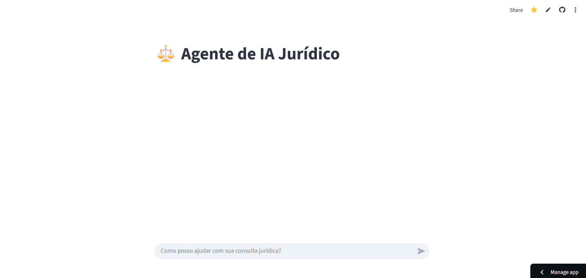

# ⚖️ Agente de IA Jurídico
Um projeto Desenvolvido com Python e Streamlit que simula um agente inteligente voltado para o universo jurídico. O objetivo é oferecer uma interface interativa para visualização de dados, estatísticas e perguntas jurídicas, com foco em acessibilidade, organização e experiência do usuário.

# 🛠️ Tecnologias Utilizadas
Python

Streamlit

Pandas

Plotly

OpenAI SDK

OpenRouter

Python Dotenv

# 📁 Estrutura do Projeto

Agente-IA-Juridico/
├── .venv/                 # Ambiente virtual (ignorado pelo Git)
├── .env                   # Chave de API e configurações locais
├── .gitignore             # Arquivos e pastas ignoradas no Git
├── requirements.txt       # Dependências do projeto
├── streamlit_app.py       # Código principal do agente jurídico
└── README.md              # Documentação do projeto

# ⚙️ Instalação e Execução Local
Crie e ative o ambiente virtual:
python -m venv .venv
.venv\Scripts\activate  # Windows

# Instale as dependências:

bash
pip install -r requirements.txt

Execute o app:

bash
streamlit run streamlit_app.py

# 📌 Licença e Contato
Este projeto é de uso livre para fins educacionais e experimentais. O conteúdo gerado pelo agente jurídico não substitui orientação profissional — recomenda-se sempre consultar um advogado qualificado para decisões legais.

**Autor:**  
**👨‍💻 Leandro Timóteo Silva — Analista de Sistemas**  
- 📧 **E-mail:** [leandrinhots6@gmail.com](mailto:leandrinhots6@gmail.com)  
- 💼 **LinkedIn:** [linkedin.com/in/leandro-timóteo-ads](https://www.linkedin.com/in/leandro-timóteo-ads)  
- 📱 **WhatsApp:** [Enviar mensagem](https://wa.me/5583987830223)

## 🎯 Demonstração Visual

### 📸 Interface do Agente Jurídico

### 🎞️ Funcionamento do Agente em Tempo Real

## 🔗 Acesse o Agente Jurídico com IA

👉 [Clique aqui para abrir o app](https://agente-ia-juridico-jtc2kzet7dikxxjvxsnhyz.streamlit.app/)

## 🔗 Repositório no GitHub
Adicione aqui o link do repositório para facilitar acesso e contribuições.

- Licença: MIT 

## 🤝 Como contribuir (rápido)
1. Fork no GitHub
2. Crie uma branch: git checkout -b feat/nova-funcionalidade
3. Faça alterações, commit e push
4. Abra um Pull Request

Thank you very much..

