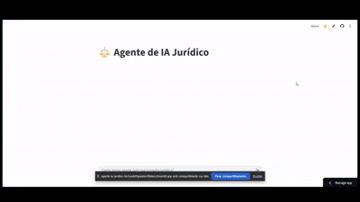

# ⚖️ Legal AI Agent
A project developed with Python and Streamlit that simulates an intelligent agent focused on the legal field.  
The goal is to provide an interactive interface for viewing data, statistics, and legal questions, with emphasis on accessibility, organization, and user experience.

# 🛠️ Technologies Used
- Python  
- Streamlit  
- Pandas  
- Plotly  
- OpenAI SDK  
- OpenRouter  
- Python Dotenv  


# 📁 Project Structure

Agente-IA-Juridico/  
├── .venv/                 # Virtual environment (ignored by Git)  
├── .env                   # API key and local settings  
├── .gitignore             # Ignored files and folders  
├── requirements.txt       # Project dependencies  
├── streamlit_app.py       # Main code of the legal agent  
└── README.md              # Project documentation  


# ⚙️ Local Installation and Execution
Create and activate the virtual environment:
```bash
python -m venv .venv
.venv\Scripts\activate  # Windows


Install dependencies:

bash
pip install -r requirements.txt
Run the app:

bash
streamlit run streamlit_app.py

📌 License and Contact
This project is free to use for educational and experimental purposes. The content generated by the legal agent does not replace professional advice — it is always recommended to consult a qualified lawyer for legal decisions.

## 👨‍💻 Author
**Leandro Timóteo Silva — Systems Analyst**

- 📧 **E-mail:** [leandrinhots6@gmail.com](mailto:leandrinhots6@gmail.com)  
- 💼 **LinkedIn:** [Leandro Timóteo ADS](https://www.linkedin.com/in/leandro-timoteo-ads)  
- 📱 **WhatsApp:** [Enviar mensagem](https://wa.me/5583987830223)

🎯 Visual Demonstration
📸 Legal Agent Interface

🎞️ Real-Time Agent Functionality

🔗 Access the Legal AI Agent


### 🎞️ FuReal-Time Agent Operationncionamento do Agente em Tempo Real



## 🔗 Access the Legal AI Agent

👉 [Click for the app](https://agente-ia-juridico-jtc2kzet7dikxxjvxsnhyz.streamlit.app/)


🔗 GitHub Repository
Add your repository link here to facilitate access and contributions.

 [](https://opensource.org/licenses/MIT)

🤝 Thank you very much!


